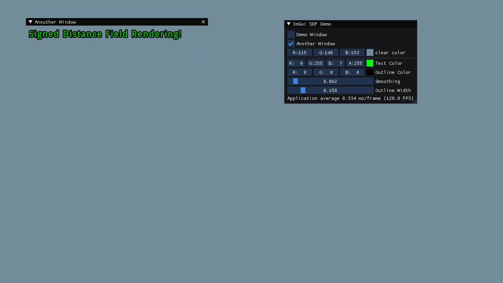

# ImGui Signed Distance Field
A hacky implementation of signed distance field rendering for text in ImGui. This uses FreeType's `FT_RENDER_MODE_SDF` and the built in freetype renderer to do all the heavily lifting. I just hacked the custom rendering callback together in ImGui's OpenGL3 implementation.




I've changed code in:
- `imgui_freetype.h`
- `imgui_freetype.cpp`
- `imgui_impl_opengl3.h`
- `imgui_impl_opengl3.cpp`

Due to a few auto formatting mishaps, doing a diff would not be very useful. For this reason I've outlined all my code using `HACK START` in comments like this:
```cpp
bool HasClipOrigin;
bool UseBufferSubData;

// HACK START
GLuint SDF_ShaderHandle;
float SDF_OrthoProjection[4][4];
// ...
GLint SDF_AttribLocationColor;
// HACK END

ImGui_ImplOpenGL3_Data() { memset((void *)this, 0, sizeof(*this)); }
```

## Building
This project uses the Meson build system, and depends on
- SDL2
- Freetype
- GL Lib

**This project uses OpenGL 3.0. This might not work on MacOS/Apple**

To build:
```
meson setup build 
meson compile -C build
```

To run:
```
./build/demo
```

## Acknowledgments
[ImGui](https://github.com/ocornut/imgui) by ([ocornut](https://github.com/ocornut)) for letting me not learn actual graphics programming

[This stackoverflow post](https://stackoverflow.com/questions/26155614/outlining-a-font-with-a-shader-and-using-distance-field) for the fragment shader
